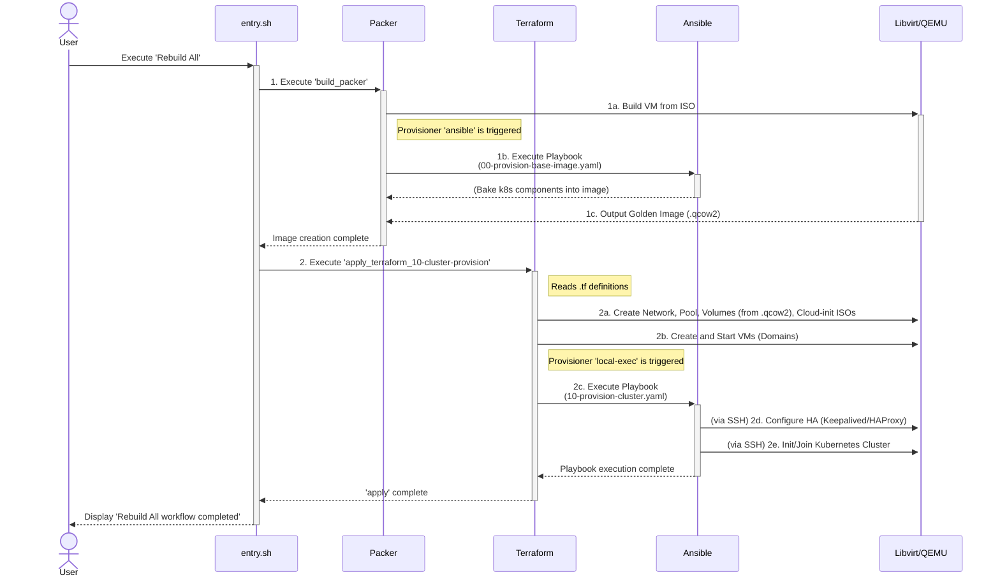

# PoC: Deploy HA Kubernetes Cluster using QEMU + KVM with Packer, Terraform, and Ansible

## Section 0. Introduction

This project serves as a personal learning initiative for IaC, utilizing QEMU-KVM to set up an HA Kubernetes Cluster in an on-premise environment. I created it mainly because I wanted to learn IaC and Kubernetes, but had exhausted my GCP free credits. Since this is currently being developed independently, the project has only been tested on RHEL 10 and Ubuntu 24 operating systems. Everyone is welcome to fork it for experimentation.

The machine specifications used for development are as follows, for reference:

-  **Chipset:** Intel® HM770
-  **CPU:** Intel® Core™ i7 processor 14700HX
-  **RAM:** Micron Crucial Pro 64GB Kit (32GBx2) DDR5-5600 UDIMM
-  **SSD:** WD PC SN560 SDDPNQE-1T00-1032

You can clone the project using the following command:

```shell
git clone https://github.com/csning1998/iac-kubeadm-deployment.git
```

### A. Disclaimer

-  This project currently only works on Linux devices with CPU virtualization support, and has **not yet** been tested on other distros such as Fedora 41, Arch, CentOS, and WSL2.
-  Currently, these features have only been tested on my personal computer through several system reinstallations, so there may inevitably be some functionality issues. I've tried my best to prevent and address these.

### B. Note

This project requires CPU with virtualization support. For users whose CPUs don't support virtualization, you can refer to the `legacy-workstation-on-ubuntu` branch. This has been tested on Ubuntu 24 to achieve the same basic functionality. Use the following in shell to check if your device support virtualization:

```shell
lscpu | grep Virtualization
```

The output may show:

-  Virtualization: VT-x (Intel)
-  Virtualization: AMD-V (AMD)
-  If there is no output, virtualization might not be supported.

### C. The Entrypoint: `entry.sh`

The content in Section 1 and Section 2 serves as prerequisite setup before formal execution. Project lifecycle management and configuration are handled through the `entry.sh` script in the root directory. After executing `./entry.sh`, you will see the following content:

```text
➜  iac-kubeadm-deployment git:(main) ✗ ./entry.sh
... (Some preflight check)

======= IaC-Driven Virtualization Management =======

Environment: NATIVE
Vault Server Status: Running (Unsealed)

 1) [ONCE-ONLY] Set up CA Certs for TLS                    11) Rebuild Packer: Kubeadm Base Image
 2) [ONCE-ONLY] Initialize Vault                           12) Rebuild Kubeadm Cluster (Packer + TF)
 3) [ONCE-ONLY] Generate SSH Key                           13) Rebuild Terraform: Full Cluster (Layer 10)
 4) [ONCE-ONLY] Setup KVM / QEMU for Native                14) Rebuild Terraform Layer 10: KVM Provision Only
 5) [ONCE-ONLY] Setup Core IaC Tools for Native            15) Rebuild Terraform Layer 10: Ansible Bootstrapper Only
 6) [ONCE-ONLY] Verify IaC Environment for Native          16) [DEV] Rebuild Layer 10 via Ansible Command
 7) Unseal Vault                                           17) Rebuild Terraform Layer 20: Harbor Server
 8) Switch Environment Strategy                            18) Rebuild Terraform Layer 50: Kubernetes Addons
 9) Reset Packer and Terraform                             19) Verify SSH
10) Rebuild Packer: Microk8s Base Image                    20) Quit

>>> Please select an action:
```

### Prerequisites

Before you begin, ensure you have the following:

-  A Linux host (RHEL 10 or Ubuntu 24 recommended).
-  A CPU with virtualization support enabled (VT-x or AMD-V).
-  `sudo` access.
-  `podman` and `podman compose` installed (for containerized mode).
-  `whois` package installed (for the `mkpasswd` command).

**A description of how to use this script follows below.**

## Section 1. Environmental Setup

### Required. KVM / QEMU

The user's CPU must support virtualization technology to enable QEMU-KVM functionality. You can choose whether to install it through option `4` via script (but this has only been tested on Ubuntu 24 and RHEL 10), or refer to relevant resources to set up the KVM and QEMU environment on your own.

### Option 1. Install IaC tools on Native

1. **Install HashiCorp Toolkit - Terraform and Packer**

   Next, you can install Terraform, Packer, and Ansible by running `entry.sh` in the project root directory and selecting option `5` for _"Setup Core IaC Tools for Native"_. Or alternatively, follow the offical installation guide:

   > _Reference: [Terraform Installation](https://developer.hashicorp.com/terraform/install)_  
   > _Reference: [Packer Installation](https://developer.hashicorp.com/packer/install)_ > _Reference: [Ansible Installation](https://docs.ansible.com/ansible/latest/installation_guide/intro_installation.html)_

   Expected output should reflect the latest versions. For instance (in zsh):

   ```text
   ...
   >>> Please select an action: 4
   >>> STEP: Verifying full native IaC environment...
   >>> Verifying Libvirt/KVM environment...
   #### QEMU/KVM: Installed
   #### Libvirt Client (virsh): Installed
   >>> Verifying Core IaC Tools (HashiCorp/Ansible)...
   #### HashiCorp Packer: Installed
   #### HashiCorp Terraform: Installed
   #### HashiCorp Vault: Installed
   #### Red Hat Ansible: Installed
   ```

### Option 2. Run IaC tools inside Container: Podman

0. _I am still looking for a method that does not require `sudo`._

1. Please ensure Podman is installed correctly. You can refer to the following URL and choose the installation method corresponding to your platform

2. After completing the Podman installation, please switch to the project root directory:

   1. If using for the first time, execute the following command

      ```shell
      sudo podman compose up --build
      ```

   2. After creating the Container, you only need to run the container to perform operations:

      ```shell
      sudo podman compose up -d
      ```

   3. Currently, the default setting is `DEBIAN_FRONTEND=noninteractive`. If you need to make any modifications and check inside the container, you can execute

      ```shell
      sudo podman exec -it iac-controller bash
      ```

      Where `iac-controller` is the Container name for the project.

   **Attention:** When switching between a Podman container and a native environment, you might encounter inconsistencies in Terraform's state within Virsh. If this happens, you can delete the `terraform/terraform.tfstate` file and run the following command to fix it.

   ```shell
   sudo virsh pool-destroy iac-kubeadm
   sudo virsh pool-undefine iac-kubeadm
   ```

### Miscellaneous

-  **Suggested Plugins for VSCode:** Enhance productivity with syntax support:

   1. Ansible language support extension. [Marketplace Link of Ansible](https://marketplace.visualstudio.com/items?itemName=redhat.ansible)

      ```shell
      code --install-extension redhat.ansible
      ```

   2. HCL language support extension for Terraform. [Marketplace Link of HashiCorp HCL](https://marketplace.visualstudio.com/items?itemName=HashiCorp.HCL)

      ```shell
      code --install-extension HashiCorp.HCL
      ```

   3. Packer tool extension. [Marketplace Link of Packer Powertools](https://marketplace.visualstudio.com/items?itemName=szTheory.vscode-packer-powertools)

      ```shell
      code --install-extension szTheory.vscode-packer-powertools
      ```

-  **Clean up Libvirt resources**: You can use the following command to remove all Libvirt resources related to this project:

   ```shell
   sudo virsh list --all --name | grep '^\(k8s\|registry\)-' | while read -r domain; do \
      sudo virsh destroy "${domain}" --graceful >/dev/null 2>&1; \
      sudo virsh undefine "${domain}" --nvram; \
   done
   for pool in iac-kubeadm iac-registry; do \
      sudo virsh vol-list --pool "${pool}" --details | awk 'NR>2 {print $1}' | while read -r vol; do \
         sudo virsh vol-delete "${vol}" --pool "${pool}"; \
      done; \
   done
   for net in iac-kubeadm-hostonly-net iac-kubeadm-nat-net iac-registry-hostonly-net iac-registry-nat-net; do \
      sudo virsh net-destroy "${net}" && sudo virsh net-undefine "${net}"; \
   done
   for pool in iac-kubeadm iac-registry; do \
      sudo virsh pool-destroy "${pool}" && sudo virsh pool-undefine "${pool}"; \
   done
   ```

## Section 2. Configuration

### Step A. Project Overview

To ensure the project runs smoothly, please follow the procedures below to complete the initialization setup.

0. **Environment variable file:** The script `entry.sh` will automatically create a `.env` environment variable that is used by for script files, which can be ignored.

1. **Generate SSH Key:** During the execution of Terraform and Ansible, SSH keys will be used for node access authentication and configuration management. You can generate these by running `./entry.sh` and entering `3` to access the _"Generate SSH Key"_ option. You can enter your desired key name or simply use the default value `id_ed25519_iac-kubeadm-deployment`. The generated public and private key pair will be stored in the `~/.ssh` directory

2. **Switch Environment:** You can switch between "Container" or "Native" environment by using `./entry.sh` and entering `8`. Currently this project primarily uses Podman, and I _personally_ recommend decoupling the Podman and Docker runtime environments to prevent execution issues caused by SELinux-related permissions. For example, SELinux policies do not allow a `container_t` process that is common in Docker to connect to a `virt_var_run_t` Socket, which may cause Terraform Provider or `virsh` to receive "Permission Denied" errors when running in containers, even though everything appears normal from a filesystem permissions perspective.

### Step B. Set up Variables

#### **Step B.0. Examine the Permissions of Libvirt**

Libvirt's settings directly impact Terraform's execution permissions, thus some permission checks are required.

1. Ensure the user's account is a member of the `libvirt` group.

   ```shell
   sudo usermod -aG libvirt $(whoami)
   ```

   **Note:** After completing this step, you must fully log out and log back in, or restart your computer, for the new group membership to take effect in your shell session.

2. Modify the `libvirtd` configuration file to explicitly state that the `libvirt` group should manage the socket.

   ```shell
   # If you use vim
   sudo vim /etc/libvirt/libvirtd.conf
   # If you use nano
   sudo nano /etc/libvirt/libvirtd.conf
   ```

   Locate and uncomment (remove the `#` from the beginning of the line) the following two lines.

   ```toml
   unix_sock_group = "libvirt"
   # ...
   unix_sock_rw_perms = "0770"
   ```

3. Override the `systemd` socket unit settings, as `systemd`'s socket configuration takes precedence over `libvirtd.conf`.

   1. Executing the following command will open a `nano` editor.

      ```shell
      sudo systemctl edit libvirtd.socket
      ```

   2. In the opened editor, paste the following content. Make sure to paste it above the line that says `### Edits below this comment will be discarded` to prevent the configuration file from becoming invalid.

      ```toml
      [Socket]
      SocketGroup=libvirt
      SocketMode=0770
      ```

      Once done, use `Ctrl+O` to save and `Ctrl+X` to exit the editor.

4. Now, the services need to be restarted in the correct order for all the settings to take effect.

   1. Reload `systemd` configurations:

      ```shell
      sudo systemctl daemon-reload
      ```

   2. Stop all related services to ensure a clean state:

      ```shell
      sudo systemctl stop libvirtd.service libvirtd.socket libvirtd-ro.socket libvirtd-admin.socket
      ```

   3. Disable `libvirtd.service` to fully hand over management to Socket Activation:

      ```shell
      sudo systemctl disable libvirtd.service
      ```

   4. Restart `libvirtd.socket`

      ```shell
      sudo systemctl restart libvirtd.socket
      ```

5. Verification

   1. Check the socket permissions: The output should show the group as `libvirt` and the permissions as `srwxrwx---`.

      ```shell
      ls -la /var/run/libvirt/libvirt-sock
      ```

   2. Execute `virsh` commands as a **non-root** user.

      ```shell
      virsh list --all
      ```

      If the command executes successfully and lists the virtual machines (even if the list is empty), it means you have all the necessary permissions.

#### **Step B.1. Create Confidential Variable File for HashiCorp Vault**

> _**All secrets will be integrated into HashiCorp Vault. This project defaults to using Vault with HTTPS configuration. Please follow the steps below to ensure correct setup.**_

1. First, run the `entry.sh` script and select option `1` to generate the files required for the TLS handshake. When creating the self-signed CA certificate, you can leave the fields blank for now. If you need to regenerate the TLS files, you can simply run option `1` again.

2. Switch to the project's root directory and run the following command to start the Vault server.

   -  If you prefer to run it on the host:

      ```shell
      vault server -config=vault/vault.hcl
      ```

   -  If you prefer to run it in a container (side-car mode):

      ```shell
      sudo podman compose up -d iac-vault-server
      ```

   After starting the server, Vault will create `vault.db` and Raft-related files in the `vault/data/` directory. If you need to reinitialize Vault, you must manually clear all files within the `vault/data/` directory.

   **Note:** Please open a new terminal window or tab for subsequent operations.

3. Once the previous steps are complete, you can run `entry.sh` and select option `2` to initialize Vault. This process will also automatically perform the required unseal action for Vault.

4. Next, you only need to manually modify the following variables used in the project.

   ```shell
   vault kv put \
      -address="https://127.0.0.1:8200" \
      -ca-cert="${PWD}/vault/tls/ca.pem" \
      secret/iac-kubeadm-deployment/variables \
      ssh_username="some-user-name-for-ssh" \
      ssh_password="some-user-password-for-ssh" \
      ssh_password_hash=$(echo -n "$ssh_password" | mkpasswd -m sha-512 -P 0) \
      vm_username="some-user-name-for-vm" \
      vm_password="some-user-password-for-vm" \
      ssh_public_key_path="~/.ssh/some-ssh-key-name.pub" \
      ssh_private_key_path="~/.ssh/some-ssh-key-name"
   ```

   -  **Note 1:**

      In which `ssh_username` and `ssh_password` are the account and password used to log into the virtual machine; while `ssh_password_hash` is the hashed password required for virtual machine automatic installation (Cloud-init). This password needs to be generated using the password string from `ssh_password`. For instance, if the password is `HelloWorld@k8s`, then the corresponding password hash should be generated using the following command:

      ```shell
      mkpasswd -m sha-512 HelloWorld@k8s
      ```

      If it shows `mkpasswd` command not found, possibly due to lack of `whois` package.

      In which `ssh_public_key_path` needs to be changed to the **public key** name generated earlier, the public key will be in `*.pub` format.

   -  **Note 2:**

      The current SSH identity variables are primarily used for Packer in a single-use scenario, while the VM identity variables are used by Terraform when cloning VMs. In principle, they can be set to the same value. However, if you need to set different names for different VMs, you can directly modify the objects and relevant code in HCL. Typically, you would modify the `node_config` variable and related variable passing, and then use a `for_each` loop for iteration. This increases complexity, so if there are no other requirements, it is recommanded to keep the SSH and VM identity variables the same.

5. When starting the project, you only need to launch the Vault server in a single terminal (maybe in your IDE) window using `vault server -config=vault/vault.hcl`. Afterward, you can use option `7` in `entry.sh` to unseal the Vault database; Alternatively, you may use container as described in B.1-2.

#### **Step B.2. Create Variable File for Terraform:**

1. You can create the `terraform/layers/10-cluster-provision/terraform.tfvars` file using the following command:

   ```shell
   cat << EOF > terraform/layers/10-cluster-provision/terraform.tfvars
   # Defines the hardware and IP addresses for each virtual machine in the cluster.
   k8s_cluster_config = {
      nodes = {
         masters = [
            { ip = "172.16.134.200", vcpu = 4, ram = 4096 },
            { ip = "172.16.134.201", vcpu = 4, ram = 4096 },
            { ip = "172.16.134.202", vcpu = 4, ram = 4096 }
         ]
         workers = [
            { ip = "172.16.134.210", vcpu = 4, ram = 4096 },
            { ip = "172.16.134.211", vcpu = 4, ram = 4096 },
            { ip = "172.16.134.212", vcpu = 4, ram = 4096 }
         ]
      }
      ha_virtual_ip = "172.16.134.250"
   }

   cluster_infrastructure = {
      network = {
         nat = {
            name        = "iac-kubeadm-nat-net"
            cidr        = "172.16.86.0/24"
            bridge_name = "k8s-nat-br" # IFNAMSIZ is 15 user-visible characters with the null terminator included.
         }
         hostonly = {
            name        = "iac-kubeadm-hostonly-net"
            cidr        = "172.16.134.0/24"
            bridge_name = "k8s-host-br"
         }
      }
   }
   EOF
   ```

   For users setting up an (HA) Cluster, the number of elements in `k8s_cluster_config.nodes.masters` and `k8s_cluster_config.nodes.workers` determines the number of nodes generated. Ensure the quantity of nodes in `k8s_cluster_config.nodes.masters` is an odd number to prevent the etcd Split-Brain risk in Kubernetes. Meanwhile, `k8s_cluster_config.nodes.workers` can be configured based on the number of IPs. The IPs provided by the user must correspond to the host-only network segment.

2. The variable file for the Registry in `terraform/layers/30-registry-provision/terraform.tfvars` is relatively simple and can be created using the following command:

   ```bash
   cat << EOF > terraform/layers/20-provision-harbor/terraform.tfvars
   # Defines the hardware and IP addresses for each virtual machine in the cluster.
   harbor_cluster_config = {
      cluster_name = "20-harbor-cluster"
      nodes = {
         harbor = [
            { ip = "172.16.135.200", vcpu = 2, ram = 4096 },
            { ip = "172.16.135.201", vcpu = 2, ram = 4096 },
            { ip = "172.16.135.202", vcpu = 2, ram = 4096 },
         ]
      }
   }

   registry_infrastructure = {
      network = {
         nat = {
            name        = "iac-registry-nat-net"
            cidr        = "172.16.87.0/24"
            bridge_name = "reg-nat-br" # IFNAMSIZ is 15 user-visible characters with the null terminator included.
         }
         hostonly = {
            name        = "iac-registry-hostonly-net"
            cidr        = "172.16.135.0/24"
            bridge_name = "reg-host-br"
         }
      }
   }
   EOF
   ```

   This architecture was designed primarily to conform to the structural specifications of the variables in the `terraform/modules/11-provisioner-kvm/variables.tf` module.

**Note:** The `bridge_name` in `terraform.tfvars` must not exceed 15 characters due to the `IFNAMSIZ(15)` limitation.

### Step C. Build / Rebuild / Reset

1. The project currently uses Ubuntu 24.04.3 for VM deployment. If you wish to use other distro as virtual machine, it is recommended that you first verify the Ubuntu Server version and checksum.

   -  The latest version is available at <https://cdimage.ubuntu.com/ubuntu/releases/24.04/release/> ,
   -  The test version of this project is also available at <https://old-releases.ubuntu.com/releases/noble/> .
   -  After selecting your version, please verify the checksum.
      -  For latest Noble version: <https://releases.ubuntu.com/noble/SHA256SUMS>
      -  For "Noble-old-release" version: <https://old-releases.ubuntu.com/releases/noble/SHA256SUMS>

   Deploying other Linux distro would be supported if I have time. I'm still a full-time university student.

2. After completing all the above setup steps, you can use `entry.sh`, enter `12` to access _"Rebuild Kubeadm Cluster (Packer + TF)"_ to perform automated deployment of the Kubernetes cluster. Based on testing, the current complete deployment of a HA Kubernetes Cluster takes approximately 7 minutes from Packer to finished.

3. For isolated testing of Packer or Terraform, you can select options `10` through `18` in `entry.sh`. The Terraform tests can be run on Layer 10's `11-provisioner-kvm` module with option `14`, Layer 10's `12-bootstrapper-ansible` module with option `15`, or both modules together with option `13`.

4. Option `16` is specifically designed for the following two scenarios:

   1. To simply test the Layer 10 Ansible Playbook rather than through Terraform
   2. To clean up all Kubernetes components in the Cluster. This is typically followed by executing option `17` _"Rebuild Terraform Layer 50: Kubernetes Addons"_ after completing option `16`

5. To test the cluster configuration by itself, you can use option `9`. This option will completely reset and clear the installer on every node in the Kubeadm Cluster and Registry Server, restoring them to a clean state. It is recommended to use this option if you need to perform isolated tests within the Ansible Playbook.

6. Option `17`'s Harbor Server is still under testing . . .

7. Option `19` primarily uses polling to test if the virtual machine is connectable and generally serves as a preliminary step for option `15`, `16`, and `17`, and `18`. Alternatively, you can use the following command to check the virtual machine's operational status.

   ```shell
   sudo virsh list --all
   ```

## Section 3. System Architecture

This project employs three tools - Packer, Terraform, and Ansible - using an Infrastructure as Code (IaC) approach to achieve a fully automated workflow from virtual machine image creation to Kubernetes cluster deployment. The overall architecture follows the principle of Immutable Infrastructure, ensuring that each deployment environment is consistent and predictable.

### A. Deployment Workflow

The entire automated deployment process is triggered by option `12` _"Rebuild Kubeadm Cluster (Packer + TF)
"_ in the `./entry.sh` script, with detailed steps shown in the diagram below:



### B. Toolchain Roles and Responsibilities

> The setup process is based on the commands provided by Bibin Wilson (2025), which I implemented using an Ansible Playbook. Thanks to the author, Bibin Wilson, for the contribution on his article
>
> Work Cited: Bibin Wilson, B. (2025). _How To Setup Kubernetes Cluster Using Kubeadm._ devopscube. <https://devopscube.com/setup-kubernetes-cluster-kubeadm/#vagrantfile-kubeadm-scripts-manifests>

1. **Packer + Ansible: Provisioning base Kubernetes Golden Image**

   Packer plays the role of an "image factory" in this project, with its core task being to automate the creation of a standardized virtual machine template (Golden Image) pre-configured with all Kubernetes dependencies. The project uses `packer/source.pkr.hcl` as its definition file and it's driven by `packer/20-k8s-base.pkrvars.hcl`, with a workflow that includes: automatically downloading the `Ubuntu Server 24.04 ISO` file and completing unattended installation using cloud-init; starting SSH connection and invoking the Ansible Provisioner after installation; executing `ansible/playbooks/00-provision-base-image.yaml` to install necessary components such as `kubelet`, `kubeadm`, `kubectl`, and `CRI-O` (also configure it to use `cgroup` driver); finally shutting down the virtual machine and producing a `*.qcow2` format template for Terraform to use. The goal of this phase is to "bake" all infrequently changing software and configurations into the image to reduce the time required for subsequent deployments.

2. **Terraform: The Infrastructure Orchestrator**

   Terraform is responsible for managing the infrastructure lifecycle and serves as the core orchestration component of the entire architecture. Terraform reads the image template produced by Packer and deploys the actual virtual machine cluster in Libvirt/QEMU. The definition files are the `.tf` files in the `terraform/` directory, with the **workflow as follows:**

   -  **Node Deployment (Layer 10)**:

      -  Based on `k8s_cluster_config` defined in `terraform/terraform.tfvars`, Terraform calculates the number of nodes that need to be created.
      -  Next, Terraform's libvirt provider will quickly clone virtual machines based on the `.qcow2` file. Under the hardware resources listed in Section 0, cloning 6 virtual machines can be completed in approximately 15 seconds.

   -  **Cluster Configuration (Layer 20)**:
      -  Once all nodes are ready, Terraform dynamically generates `ansible/inventory.yaml` list file.
      -  Then, Terraform invokes Ansible to execute the `ansible/playbooks/10-provision-cluster.yaml` Playbook to complete the initialization of the Kubernetes cluster.

3. **Ansible: The Configuration Manager**

   This is the twice call for Ansible, serving as the configuration manager at different stages. The project's Playbooks are stored in the `ansible/playbooks/ directory`. In terms of role assignment, Ansible is primarily responsible for cluster initialization (invoked by Terraform), executing the following tasks through the `10-provision-cluster.yaml` Playbook:

   1. Setup HA Load Balancer on all master nodes if it's not a cluster with single master node.
   2. Initialize the primary master node
   3. Generate and fetch join commands from primary master
   4. Executing `kubeadm join` on
      1. Other master node if it's HA Cluster
      2. Worker nodes to join them to the cluster.

4. **HashiCorp Vault (with TLS)**

   HashiCorp Vault is integrated into this project to serve as a centralized and secure backend for managing all sensitive data, such as SSH credentials and user passwords. This approach removes the need to store plaintext secrets in version-controlled files like `*.tfvars` or `*.pkrvars.hcl`, aligning with Infrastructure as Code best practices.

   Both the `native` (host-based) and `container` (Podman-based) IaC execution strategies can connect to the same containerized Vault instance through the host network (`network_mode: "host"`). The Vault server is configured to start automatically on system boot if you use container, ensuring the secrets backend is always available for the IaC workflow without manual intervention.

   -  **Packer:** During the image-building phase, Packer authenticates with the Vault server and uses the `vault()` function within its HCL files to dynamically fetch the necessary secrets (e.g., `ssh_username`, `ssh_password_hash`) required for the unattended OS installation.

   -  **Terraform:** Similarly, Terraform utilizes the Vault Provider to read infrastructure-related secrets, such as `vm_username` and `ssh_private_key_path`, directly from Vault at runtime. This allows Terraform to provision VMs and configure SSH access without exposing any sensitive credentials in its configuration files.

### C. Infrastructures

_**(To be continued...)**_
