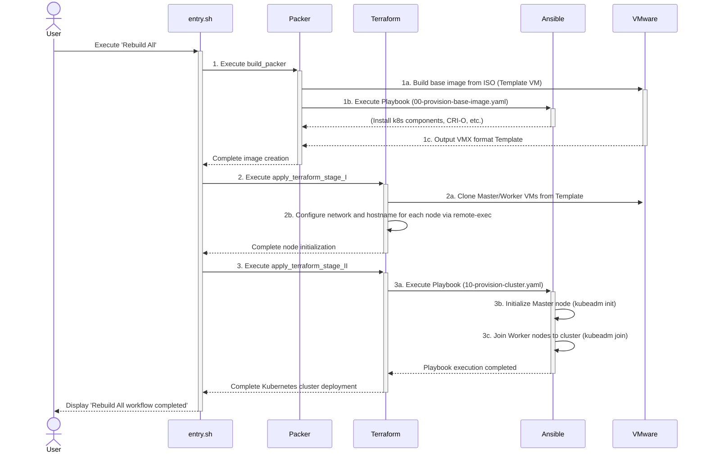

# PoC: Deploy VMs on Workstation 17.x using Packer + Terraform + Ansible

## Section 0. Choice of Hypervisor: VMware Workstation

This project utilizes VMware Workstation as the virtualization platform for several key reasons aligned with its goals as an Infrastructure as Code (IaC) learning tool and local development environment:

### A. Accessibility

Unlike Type-1 hypervisors such as vSphere (ESXi), VMware Workstation runs on standard desktop operating systems such as Linux (preferred) and Windows. This eliminates the need for dedicated server hardware and expensive licensing, lowering the barrier to entry for developers, students, and home lab enthusiasts who wish to replicate this setup.

### B. Developer-Friendly Workflow

Workstation Pro 17 provides an integrated GUI and console access, which is invaluable during the development and debugging of IaC scripts. When an automated process fails, the ability to immediately inspect a VM's state via a familiar interface significantly speeds up troubleshooting compared to managing a remote, headless hypervisor.

### C. Project Scope

The primary objective of this project is to establish an automated Kubernetes deployment for my personal practice in deploying a distributed GitLab Helm service on Kubernetes, which is not to build a production-grade, highly-available cluster. (or maybe someday, who knows?) The features offered by Workstation (e.g., snapshots, simple networking) are perfectly suited for this purpose, while the advanced enterprise features of vSphere are not required. The core automation logic developed here remains largely portable to other platforms.

### D. Comparison with Oracle VirtualBox

Although VirtualBox is a quite good open-source alternative, the choice of VMware Workstation for this project is based on its performance in multi-node environments, its virtualization driver architecture for networking and storage I/O, especially the Paravirtualized network card (VMXNET3) and storage controllers (PVSCSI, NVMe) inherited from the enterprise-grade ESXi product line. This Type 1 Hypervisor-like architecture is well-suited for Kubernetes development and testing work. In comparison, while VirtualBox is a feature-complete, free, and open-source solution suitable for lightweight loads and general purposes, its performance limitations in I/O-intensive multi-node scenarios would affect the stability and responsiveness of the cluster.

### E. Operating System for this Project

This project is currently only implemented on Ubuntu/Debian Linux systems, with Ubuntu Desktop 24 LTS as the operating system. The entry script files are currently written using apt, with support for other Linux distros planned for the future.

You can clone the project using the following command:

```shell
git clone https://github.com/csning1998/iac-kubeadm-deployment.git
```

The content in Section 1 and Section 2 serves as prerequisite setup before formal execution. Project lifecycle management and configuration are handled through the `entry.sh` script in the root directory. After executing `./entry.sh`, you will see the following content:

```text
➜  iac-kubeadm-deployment git:(main) ✗ ./entry.sh
(base) ➜  iac-kubeadm-deployment git:(ha-cluster) ✗ ./entry.sh
VMware Workstation VM Management Script
VMware Workstation VM Management Script
1) Setup IaC Environment                         9) [DEV] Rebuild Stage II via Ansible
2) Generate SSH Key                             10) Verify SSH
3) Reset All                                    11) Check VM Status
4) Rebuild All                                  12) Start All VMs
5) Rebuild Packer                               13) Stop All VMs
6) Rebuild Terraform: All Stage                 14) Delete All VMs
7) Rebuild Terraform Stage I: Configure Nodes   15) Quit
8) Rebuild Terraform Stage II: Ansible
Please select an action:
```

A description of how to use this script follows below.

## Section 1. Environmental Setup

### Installation

1. **VMware Workstation**

   VMware Workstation Pro 17 is the virtual machine application used in this IaC project. You need to register an account on broadcom.com, then click [here to download Workstation Pro 17](https://support.broadcom.com/group/ecx/productdownloads?subfamily=VMware%20Workstation%20Pro&freeDownloads=true).

   After installation, configure VMware Network Editor:

   - Open VMware Network Editor (`vmware-netcfg`).
   - Ensure `vmnet8` is set to NAT with subnet `172.16.86.0/24` and DHCP enabled.
   - Ensure `vmnet1` is set to Host-only with subnet `172.16.134.0/24` (no DHCP).

2. **Install HashiCorp Toolkit - Terraform and Packer**

   Next, you can install Terraform, Packer, and Ansible by running entry.sh in the project root directory and selecting the first option _"Setup IaC Environment"_

   > _Reference: [Terraform Installation](https://developer.hashicorp.com/terraform/install)_  
   > _Reference: [Packer Installation](https://developer.hashicorp.com/packer/install)_

   Add the HashiCorp repository and install the latest versions:

   ```shell
   wget -O - https://apt.releases.hashicorp.com/gpg | sudo gpg --dearmor -o /usr/share/keyrings/hashicorp-archive-keyring.gpg
   echo "deb [arch=$(dpkg --print-architecture) signed-by=/usr/share/keyrings/hashicorp-archive-keyring.gpg] https://apt.releases.hashicorp.com $(lsb_release -cs) main" | sudo tee /etc/apt/sources.list.d/hashicorp.list
   sudo apt update && sudo apt install terraform packer -y
   ```

3. **Install Ansible**

   > _Reference: [Ansible Installation on Ubuntu](https://docs.ansible.com/ansible/latest/installation_guide/installation_distros.html#installing-ansible-on-ubuntu)_

   ```shell
   sudo apt install software-properties-common -y
   sudo add-apt-repository --yes --update ppa:ansible/ansible
   sudo apt install ansible -y
   ```

4. **Verification**

   Verify each tool to confirm successful setup:

   ```shell
   # Verify VMware Workstation
   vmware --version

   # Verify Packer
   packer --version

   # Verify Terraform
   terraform --version

   # Verify Ansible
   ansible --version
   ```

   Expected output should reflect the latest versions (e.g., Terraform > v1.5, Packer > v1.9, Ansible > v2.15). For instance (in zsh):

   ```text
   (base) ➜  ~ vmware --version
   VMware Workstation 17.5.0 build-22583795
   (base) ➜  ~ packer --version
   Packer v1.9.4
   (base) ➜  ~ terraform --version
   Terraform v1.9.4
   on linux_amd64
   (base) ➜  ~ ansible --version
   ansible [core 2.18.7]
      config file = /etc/ansible/ansible.cfg
      configured module search path = ['/home/someUserName/.ansible/plugins/modules', '/usr/share/ansible/plugins/modules']
      ansible python module location = /usr/lib/python3/dist-packages/ansible
      ansible collection location = /home/someUserName/.ansible/collections:/usr/share/ansible/collections
      executable location = /usr/bin/ansible
      python version = 3.12.3 (main, Jun 18 2025, 17:59:45) [GCC 13.3.0]
      jinja version = 3.1.2
      libyaml = True
   ```

5. **Suggested Plugins for VSCode**

   Enhance productivity with syntax support:

   1. Ansible language support extension. [Marketplace Link of Ansible](https://marketplace.visualstudio.com/items?itemName=redhat.ansible)

      ```shell
      code --install-extension redhat.ansible
      ```

   2. HCL language support extension for Terraform. [Marketplace Link of HashiCorp HCL](https://marketplace.visualstudio.com/items?itemName=HashiCorp.HCL)

      ```shell
      code --install-extension HashiCorp.HCL
      ```

   3. Packer tool extension. [Marketplace Link of Packer Powertools](https://marketplace.visualstudio.com/items?itemName=szTheory.vscode-packer-powertools)

      ```shell
      code --install-extension szTheory.vscode-packer-powertools
      ```

## Section 2. Configuration

### Step A. Network Configuration

The virtual machines deployed in this project use a dual network mode with the following specifications:

- NAT Network (`vmnet8`): This network interface provides virtual machines with access to external internet during system installation and subsequent operations. The Subnet is `172.16.86.0/24`
- Host-only Network (`vmnet1`): This network interface is dedicated for communication between Kubernetes cluster nodes and allows the host system to access internal cluster services. The Subnet is `172.16.134.0/24`

These parameters currently need to be set manually. In the future, these two parameters can be adjusted in the `scripts/config.sh` file.

### Step B. Initial Project Setup

To ensure the project runs smoothly, please follow the procedures below to complete the initialization setup.

1. **Generate SSH Key**During the execution of Terraform and Ansible, SSH keys will be used for node access authentication and configuration management. You can generate these by running `./entry.sh` and entering `2` to access the _"Generate SSH Key"_ option. You can enter your desired key name or simply use the default value `id_ed25519_iac_automation`. The generated public and private key pair will be stored in the `~/.ssh` directory
2. **Create Secret Variable Files**

   During the Packer and Terraform execution process, user-defined variables need to be set up, which requires manually creating the following variable files. For security considerations, these files have already been preconfigured in `.gitignore` and will not be included in version control.

   - **For Packer:** You can create the `packer/secret.auto.pkrvars.hcl` file using the following command:

      ```bash

      VM_USERNAME="YOUR_VM_USERNAME"
      VM_PASSWORD="YOUR_VM_PASSWORD"
      HASHED_PASSWORD=$(echo -n "$VM_PASS" | mkpasswd -m sha-512 -P 0)

      cat << EOF > packer/secret.auto.pkrvars.hcl
      ssh_username = "$VM_USERNAME"
      ssh_password = "$VM_PASSWORD"
      ssh_password_hash = "$HASHED_PASSWORD"
      ssh_public_key_path = "~/.ssh/id_ed25519_iac_automation.pub"
      EOF
      ```

      In which `ssh_username` and `ssh_password` are the account and password used to log into the virtual machine; while `ssh_password_hash` is the hashed password required for virtual machine automatic installation (Cloud-init). This password needs to be generated using the password string from `ssh_password`. For instance, if the password is `HelloWorld@k8s`, then the corresponding password hash should be generated using the following command:

      ```bash
      mkpasswd -m sha-512 HelloWorld@k8s
      ```

      And `ssh_public_key_path`: needs to be changed to the **public key** name generated earlier, the public key will be in `*.pub` format

   - **For Terraform:** You can create the `terraform/terraform.tfvars` file using the following command with `VM_USERNAME` and `VM_PASSWORD` above:

      ```bash
      cat << EOF > terraform/terraform.tfvars

      vm_username = "$VM_USERNAME"
      vm_password = "$VM_PASSWORD"
      ssh_private_key_path = "~/.ssh/id_ed25519_iac_automation"

      # For cluster with single master
      master_ip_list = ["172.16.134.200"]

      # For cluster with high availability
      # master_ip_list = ["172.16.134.200", "172.16.134.201", "172.16.134.202"]

      # Worker nodes
      worker_ip_list = ["172.16.134.210", "172.16.134.211", "172.16.134.212"]
      EOF
      ```

      For users setting up an HA Cluster, the number of elements in `master_ip_list` and `worker_ip_list` determines the number of nodes generated. Ensure the length of `master_ip_list` is an odd number to prevent the etcd Split-Brain risk in Kubernetes. Meanwhile, `worker_ip_list` can be configured based on the number of IPs. The IPs provided by the user must correspond to the host-only network segment.

   **Note:** Please make sure to replace `YOUR_VM_USERNAME` and `YOUR_VM_PASSWORD` with the actual credentials you wish to use. If you specified a non-default key name in the previous step, you must also update the `ssh_public_key_path` and `ssh_private_key_path` fields accordingly

3. **[Deprecated] Set up Ansible Vault**

   > This section would be replaced by **HashiCorp Vault** for more environmental consistency.
   >

   Although Ansible Vault setup is currently mandatory, the related configurations are still being integrated. You need to run ./entry.sh, enter 3 to access the "Set up Ansible Vault" option. At this point, the terminal will ask you to enter a password to encrypt the Vault, and by default it uses the host user's username as the vault_vm_username variable. The system will prompt whether this is the correct login name. Since some people prefer different virtual machine usernames, if you choose to use a different username, the system will open the vim editor for you to enter it manually. After completing the operation, the following two files will be generated:

   1. `vault_pass.txt`: Stores the password used to decrypt the Vault, this file is already included in `.gitignore` by default.
   2. `ansible/group_vars/vault.yaml`: This is an encrypted variable file

4. After completing all the above setup steps, you can use `entry.sh`, enter `5` to access _"Rebuild All"_ to perform automated deployment of the Kubernetes cluster. Based on testing, the current complete deployment of a Kubernetes Cluster takes approximately 21 minutes, with an average time of about 3 minutes to configure each node.

> The setup process is based on the commands provided by Bibin Wilson (2025), which I implemented using an Ansible Playbook. Thanks to the author, Bibin Wilson, for the contribution on his article
>
> Work Cited: Bibin Wilson, B. (2025). _How To Setup Kubernetes Cluster Using Kubeadm._ devopscube. <https://devopscube.com/setup-kubernetes-cluster-kubeadm/#vagrantfile-kubeadm-scripts-manifests>

## Section 3. System Architecture

This project employs three tools - Packer, Terraform, and Ansible - using an Infrastructure as Code (IaC) approach to achieve a fully automated workflow from virtual machine image creation to Kubernetes cluster deployment. The overall architecture follows the principle of Immutable Infrastructure, ensuring that each deployment environment is consistent and predictable.

### Deployment Workflow

The entire automated deployment process is triggered by the fifth option _"Rebuild All"_ in the `./entry.sh` script, with detailed steps shown in the diagram below:



### Toolchain Roles and Responsibilities

1. **Packer + Ansible: Provisioning base Kubernetes Golden Image**

   Packer plays the role of an "image factory" in this project, with its core task being to automate the creation of a standardized virtual machine template (Golden Image) pre-configured with all Kubernetes dependencies. The project uses `packer/ubuntu-server-24.pkr.hcl` as its definition file, with a workflow that includes: automatically downloading the `Ubuntu Server 24.04 ISO` file and completing unattended installation using cloud-init; starting SSH connection and invoking the Ansible Provisioner after installation; executing `ansible/playbooks/00-provision-base-image.yaml` to install necessary components such as `kubelet`, `kubeadm`, `kubectl`, and `CRI-O` (also configure it to use `cgroup` driver); finally shutting down the virtual machine and producing a `*.vmx` format template for Terraform to use. The goal of this phase is to "bake" all infrequently changing software and configurations into the image to reduce the time required for subsequent deployments.

2. **Terraform: The Infrastructure Orchestrator**

   Terraform is responsible for managing the infrastructure lifecycle and serves as the core orchestration component of the entire architecture. Terraform reads the image template produced by Packer and deploys the actual virtual machine cluster in VMware Workstation. The definition files are the .tf files in the terraform/ directory, with the **workflow as follows:**

   - **Node Deployment (Stage I)**:

     - Based on `master_ip_list` and `worker_ip_list` defined in `terraform/terraform.tfvars`, Terraform calculates the number of nodes that need to be created.
     - Using the `vmrun` clone command, it quickly replicates multiple virtual machine instances from the `*.vmx` template created by Packer.
     - Using `remote-exec`, it executes Shell commands on each node to configure static IP addresses, hostnames, and other network settings.

   - **Cluster Configuration (Stage II)**:
     - Once all nodes are ready, Terraform dynamically generates `ansible/inventory.yaml` list file.
     - Then, Terraform invokes Ansible to execute the `ansible/playbooks/10-provision-cluster.yaml` Playbook to complete the initialization of the Kubernetes cluster.

3. **Ansible: The Configuration Manager**

   This is the twice call for Ansible, serving as the configuration manager at different stages. The project's Playbooks are stored in the `ansible/playbooks/ directory`. In terms of role assignment, Ansible is primarily responsible for cluster initialization (invoked by Terraform), executing the following tasks through the `10-provision-cluster.yaml` Playbook:

   1. Initializing the control plane on the Master node with kubeadm init.
   2. Installing Calico as the CNI network plugin. (This will be integrated to Kubernetes or Helm Provider from HashiCorp official)
   3. Obtaining the join-command from the Master node.
   4. Executing `kubeadm join` on all Worker nodes to join them to the cluster.

## Section 4. Evolution of the Architecture

### Phase 1. Migration from VirtualBox to VMware

The project initially used VirtualBox, but the build process frequently encountered `VBOX_E_INVALID_OBJECT_STATE` errors, and cache pollution in `~/.cache/packer` would lead to undeletable "Ghost Drives," causing UUID conflicts and subsequent build failures. Migrated to VMware Workstation resolves these "wierd" issues. After migration, it’s discovered that VMware dynamically names network interfaces based on PCI slots, causing `e1000` and `vmxnet3` drivers to generate different interface names (such as `ens32` or `ens33`) in different scenarios, which broke the fixed Netplan configuration in Terraform's `remote-exec`. The solution was to add logic in the `remote-exec` script to dynamically detect network interface names, though future adjustments will still be necessary.

### Phase 2. Implementing Cluster Scalability

After achieving stable deployment of a single node, the project focus shifted to clustering. The implementation involved introducing two array variables, `master_ip_list` and `worker_ip_list`, in `terraform.tfvars`. Terraform determines the number of VMs to clone based on the length of these arrays, and dynamically generates the `inventory.yaml` list needed by Ansible from a `*.tftpl` template. Additionally, to facilitate manual login verification, Terraform generates a `~/.ssh/k8s_cluster_config` file on the local machine, allowing users to log in without a password using aliases like `ssh k8s-master-00`.

### Phase 3. Shifting Common Settings "Left" to Packer

As the architecture gradually expanded, efficiency issues began to emerge. With every execution of `terraform apply`, Ansible would repeatedly perform the same basic tasks on all nodes: installing specific versions of `kubelet`, CRI-O, configuring `sysctl` kernel parameters, disabling `swap`, and other identical foundational tasks. For these highly repetitive behaviors, the project underwent an architectural adjustment, shifting all these common and static preliminary operations from the Terraform stage "left" to the Packer image creation phase.

This refactoring resulted in Packer producing a Golden Image that serves as a template image already containing all K8s dependencies, while Terraform's responsibility was simplified to purely VM cloning and network configuration, significantly reducing overall deployment time. Since cloning virtual machines would cause duplicate IP addresses for NAT network cards, the design modifies the fourth segment of the IP to match the fourth segment of the hostonly-defined IP. For instance, if the IP defined in the hostonly network card is `172.16.134.101`, then the corresponding NAT IP would be `172.16.86.101`.

### Phase 4. Code Structure Refactoring and SSH Process Automation

The goal of this phase was to resolve code duplication issues. Two major refactorings were implemented:

1. **SSH Process Automation:** To achieve completely hands-free Key-Based authentication, the specified SSH public key is directly "baked" into the `authorized_keys` file of the image during the Packer build phase. The `./entry.sh` script was also enhanced with `generate_ssh_key` helper functionality and `check_ssh_key_exists` preliminary checks. To avoid polluting the user's global `~/.ssh/config`, Terraform now generates a project-specific SSH configuration file (`~/.ssh/k8s_cluster_config`), and dynamically loads it through `local-exec` by adding a line `Include ~/.ssh/k8s_cluster_config` to the global configuration file. This project-specific configuration file is removed during `terraform destroy`, ensuring environment isolation and cleanliness.
2. **Centralization of Terraform Variable Structure:** Previously, both the `vm` and `ansible` submodules within Terraform had their own for loops to process node data, creating logical duplication that stemmed from technical debt incurred during personal refactoring with extensive copy-pasting. This phase centralized all complex variable combination logic for node paths, names, etc., into a unified computation in the root directory's `locals.tf`. Submodules were refactored to receive only the final, pre-assembled `all_nodes` object as input, eliminating duplicate for loops and computation logic within modules. This change created a Single Source of Truth, cutting down complexity for future updates and expansions.
